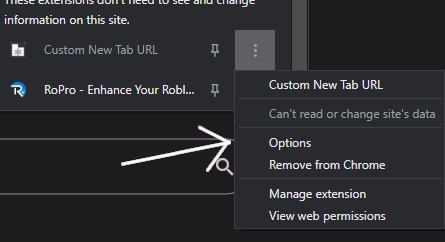
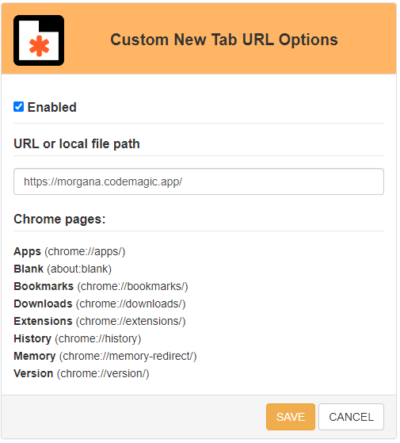
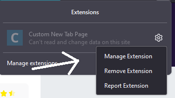
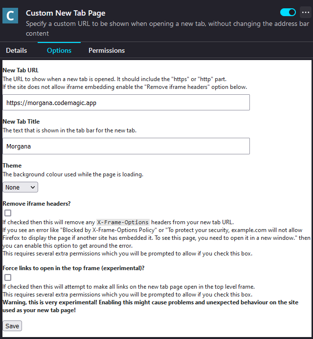

# Morgana
[Morgana](https://morgana.codemagic.app/) is a free new tab app made in <b>Flutter</b> by Apollo Daniel

# Features
- Morgana has 3 basic search engines for the search bar that can be changed in the settings.
- Morgana settings can be exported to a Json file and imported into another device or browser.
- Morgana settings change the user interface in real time and save automatically.
- User can add their favorite websites at home, also can remove and edit them.
- Morgana uses [FontAwesome](https://fontawesome.com/) icons for user favorites icons

# How to setup Morgana

### Chrome
You need to install this [extension](https://chrome.google.com/webstore/detail/mmjbdbjnoablegbkcklggeknkfcjkjia)
With the extension installed, you will need to go into the settings to add your custom link, in this case, the added link would be https://morgana.codemagic.app

Once installed, simply follow the following steps:
#### Step 1

#### Step 2

### Firefox
You need to install this [extension](https://addons.mozilla.org/pt-BR/firefox/addon/custom-new-tab-page/ "extension")
With the extension installed, you will need to go into the settings to add your custom link, in this case, the added link would be https://morgana.codemagic.app

Once installed, simply follow the following steps:
#### Step 1

#### Step 2

# Flutter Dependencies
- [mobx](https://pub.dev/packages/mobx)
- [provider](https://pub.dev/packages/provider)
- [flutter_colorpicker](https://pub.dev/packages/flutter_colorpicker)
- [top_snackbar_flutter](https://pub.dev/packages/top_snackbar_flutter)
- [file_picker](https://pub.dev/packages/file_picker)
- [mime](https://pub.dev/packages/mime)
- [font_awesome_flutter](https://pub.dev/packages/font_awesome_flutter)
- [shared_preferences](https://pub.dev/packages/shared_preferences)
